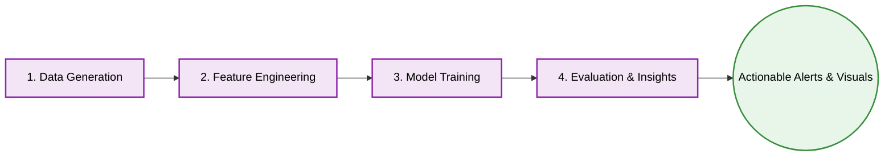
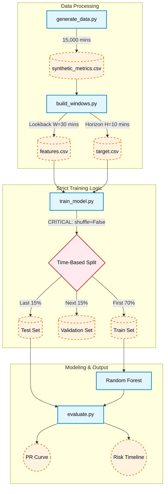
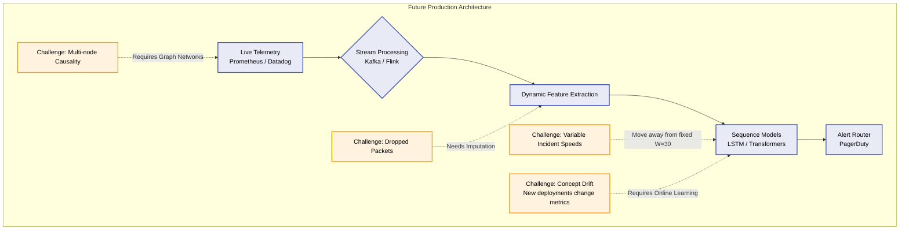

# System Design & Architecture Document
**Predictive Alerting for Cloud Metrics**

## Overview
This document serves as an extended architectural overview of the Predictive Alerting project. It details the decision-making process, tool selection, data strategy, and outlines how this proof-of-concept can be scaled into a production-ready alerting system.

---

## 1. Tech Stack & Tools
The project deliberately relies on a robust, industry-standard data science stack to ensure reproducibility and stability:
* **Python 3:** The core language for data processing and modeling.
* **Pandas & NumPy:** Chosen for efficient time-series manipulation, rolling window calculations, and tabular data management.
* **Scikit-learn:** Selected as the primary ML framework. For tabular time-series features, tree-based models (Random Forest) and linear baselines (Logistic Regression) are highly effective, interpretability-friendly, and faster to train than deep learning approaches.
* **Jupyter Notebook:** Acts as the Presentation Layer (`solution.ipynb`), combining code execution, narrative text, and visual artifacts into a cohesive story.
* **Mermaid.js:** Used for documentation as code (diagrams), ensuring that architectural schemas live alongside the codebase and are version-controlled without relying on external image files.

---

## 2. Overall High-Level Architecture
Below is the macroscopic view of the project's lifecycle, from raw data generation to final business insights.

---

## 3. Data Strategy: Synthetic Metrics
**Why Synthetic Data?**
High-quality, labeled datasets of severe cloud infrastructure outages are rarely open-sourced due to strict NDAs and security policies. By synthesizing the data, we achieve:
1. **Total Control:** We can programmatically define the exact lifecycle of an incident (normal state -> degradation -> active incident -> recovery).
2. **Realistic Imbalance:** We explicitly engineered a realistic class imbalance (~95% normal, ~5% incidents) to properly test the model's alerting capabilities without artificial balancing.

**How it's generated:** We use statistical distributions (Normal for CPU/Memory, Lognormal for Latency, Exponential for Error Rates) and inject programmatic spikes and trends to simulate failures.

---

## 4. Project Details: The ML Pipeline
This section details the inner workings of the `src/` directory.

### Key Design Decisions:
* **Feature Aggregation:** Instead of feeding 30 raw minutes (120 dimensions) into the model, we compute statistical summaries (mean, std, min, max, diff). This mitigates the curse of dimensionality and helps tree-based models find split points easier.
* **Strict Time-Based Split:** We explicitly set `shuffle=False` in `train_test_split`. Randomly shuffling time-series data causes *Data Leakage* (the model learns from future events to predict past events).
* **PR AUC over Accuracy:** Because the dataset is highly imbalanced, Accuracy is misleading (always predicting "0" yields 95% accuracy). We use Precision-Recall AUC to measure how well the model handles the minority class (incidents) without generating alert fatigue.

---

## 5. Production Readiness & Future Work
While this proof-of-concept successfully predicts synthetic incidents, deploying it to a real-world Kubernetes cluster requires addressing several system complexities.

**Production Upgrades to Consider:**
1. **Handling Concept Drift:** Cloud metrics are non-stationary. A new software deployment might increase the baseline CPU usage permanently. The system needs "Online Learning" (continuous retraining) and drift detection (e.g., Evidently AI) to avoid false positives over time.
2. **Dynamic Horizons:** A memory leak might take days to crash a system, while a traffic spike takes seconds. Fixed windows ($W=30$, $H=10$) should be replaced by multi-scale windows (5m, 1h, 24h) or RNNs/Transformers that dynamically learn context length.
3. **Multivariate Causality:** In a microservices architecture, a CPU spike on Node A might be caused by a database lock on Node B. Future iterations should incorporate Distributed Tracing (OpenTelemetry) and graph-based features.

---

## 6. References & Acknowledgment
The architecture, feature engineering methodology, and evaluation strategies in this project were synthesized based on industry best practices:
* **Google Site Reliability Engineering (SRE) Handbook:** For definitions of monitoring, alerting fatigue, and incident management.
* **Scikit-learn Documentation:** Specifically guidelines on handling Imbalanced Datasets (`class_weight='balanced'`) and Cross-Validation for Time Series.
* **Feature Engineering for Time Series:** Standard sliding window techniques used in classic anomaly detection.
* *Note: The structural synthesis, code generation assistance, and markdown formatting of this project were accelerated using Google's Gemini AI, specifically instructed to adhere to industry-standard data science and software engineering patterns.*

