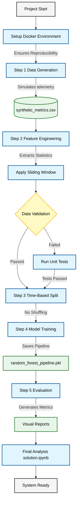
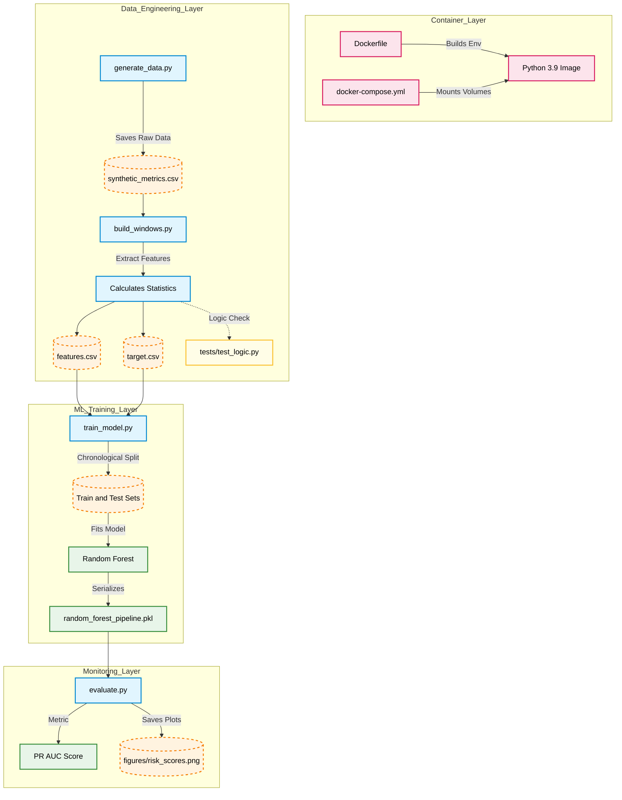

# Predictive Alerting for Cloud Metrics

A professional Machine Learning pipeline designed to predict infrastructure incidents before they occur. This project demonstrates end-to-end engineering: from synthetic data generation to automated model evaluation, unit testing, and containerization.

---

## 🚀 Problem Formulation
This task is formulated as a **binary classification problem over time-series data**:

* **Goal:** Predict whether an incident will occur within the next **H** steps based on the previous **W** steps of system behavior.
* **Input (Features):** Previous `W = 30` time steps (look-back window).
* **Prediction Horizon (Target):** Next `H = 10` time steps.
* **Output:** * `1` — an incident **will occur** within the next H steps.
  * `0` — no incident will occur.
* **Time Scale:** One time step represents **1 minute**.

---

## 🏗 Architecture Flow
This diagram illustrates the high-level project lifecycle and technical branching.



---

## 🔬 The Microscopic View
Detailed module interaction and data transformation pipeline.



## 🚀 Quick Start (Docker)
Run the entire pipeline with one command:

```bash
docker-compose up --build
```

## 🧪 Quality Assurance
* **Unit Testing:** `python -m unittest discover tests`
* **CI/CD:** Automated testing via **GitHub Actions** on every push.
* **Type Hinting:** Fully implemented for robust maintenance.
* **Reproducibility:** Guaranteed by Docker containerization.
