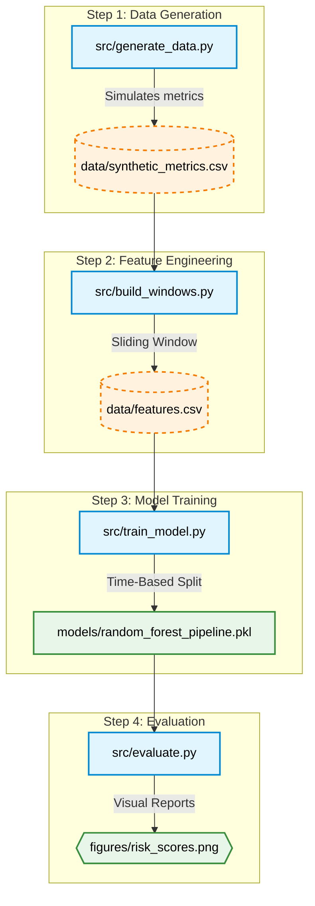

# Predictive Alerting for Cloud Metrics

A professional Machine Learning pipeline designed to predict infrastructure incidents before they occur. This project demonstrates end-to-end engineering: from synthetic data generation to automated model evaluation, unit testing, and containerization.

---

## 🚀 Problem Formulation
This task is formulated as a **binary classification problem over time-series data**:
* **Input:** previous `W = 30` time steps.
* **Prediction horizon:** next `H = 10` time steps.
* **Output:**
  * `1` — an incident will occur within the next H steps.
  * `0` — no incident will occur within the next H steps.
* **Time Step:** One time step represents **1 minute**.
* **Logic:** The model uses the previous **30 minutes** of monitoring data to predict whether an incident will happen during the next **10 minutes**.

---

## 🛠 Project Structure
```text
predictive-alerting-cloud-metrics/
├─ src/                        # Core Python modules with Type Hinting
│  ├─ generate_data.py         # Synthetic telemetry generation
│  ├─ build_windows.py         # Feature engineering (sliding windows)
│  ├─ train_model.py           # Model training (Time-based split)
│  └─ evaluate.py              # Performance metrics & plotting
├─ notebooks/                  # Interactive analysis
│  └─ solution.ipynb           # Final project walkthrough
├─ tests/                      # Quality Assurance
│  └─ test_logic.py            # Unit tests for feature extraction
├─ data/                       # Raw and processed datasets
├─ models/                     # Serialized model pipelines (.pkl)
├─ figures/                    # PR Curves and Risk Timelines
├─ DESIGN_DOC.MD               # Detailed architecture and design decisions
├─ Dockerfile                  # Container definition
├─ docker-compose.yml          # Multi-container orchestration
├─ requirements.txt            # Project dependencies
└─ README.md                   # Project overview
```


---

## 🚀 Quick Start (Docker)
The easiest way to run the entire pipeline (data generation -> feature engineering -> training -> evaluation) is using Docker Compose. This ensures a consistent environment:

```bash
docker-compose up --build
```


---

## 📊 Key Engineering Features
* **Early Warning System:** Successfully predicts incidents 10 minutes ahead using a 30-minute sliding window of telemetry.
* **Engineering Excellence:**
    * Full **Type Hinting** for code clarity and maintainability.
    * Automated **CI via GitHub Actions** (runs tests on every push).
    * **Unit Testing** to ensure mathematical correctness of features.
    * **Containerization** via Docker for seamless deployment.
* **Robust ML Pipeline:** Utilizes a Random Forest model with `class_weight='balanced'` to handle highly imbalanced cloud datasets.

## 🧪 Running Tests Manually
If you are not using Docker, you can verify the logic using:
```bash
python -m unittest discover tests
```


---

## Architecture Flow

