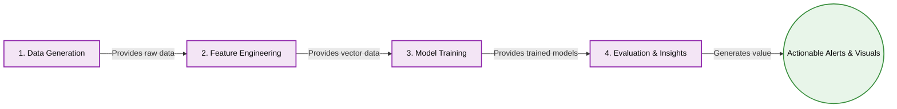

# Predictive Alerting for Cloud Metrics

A professional Machine Learning pipeline designed to predict infrastructure incidents before they occur. This project demonstrates end-to-end engineering: from synthetic data generation to automated model evaluation, unit testing, and containerization.

---

## 🚀 Problem Formulation
This task is formulated as a **binary classification problem over time-series data**:
* **Input:** previous `W = 30` time steps.
* **Prediction horizon:** next `H = 10` time steps.
* **Output:**
  * `1` — an incident will occur within the next H steps.
  * `0` — no incident will occur within the next H steps.
* **Time Step:** One time step represents **1 minute**.
* **Logic:** The model uses the previous **30 minutes** of monitoring data to predict whether an incident will happen during the next **10 minutes**.

---

## 🛠 Project Structure
```text
predictive-alerting-cloud-metrics/
├─ src/                        # Core Python modules with Type Hinting
│  ├─ generate_data.py         # Synthetic telemetry generation
│  ├─ build_windows.py         # Feature engineering (sliding windows)
│  ├─ train_model.py           # Model training (Time-based split)
│  └─ evaluate.py              # Performance metrics & plotting
├─ notebooks/                  # Interactive analysis
│  └─ solution.ipynb           # Final project walkthrough
├─ tests/                      # Quality Assurance
│  └─ test_logic.py            # Unit tests for feature extraction
├─ data/                       # Raw and processed datasets
├─ models/                     # Serialized model pipelines (.pkl)
├─ figures/                    # PR Curves and Risk Timelines
├─ DESIGN_DOC.MD               # Detailed architecture and design decisions
├─ Dockerfile                  # Container definition
├─ docker-compose.yml          # Multi-container orchestration
├─ requirements.txt            # Project dependencies
└─ README.md                   # Project overview
```


---

## 🚀 Quick Start (Docker)
The easiest way to run the entire pipeline (data generation -> feature engineering -> training -> evaluation) is using Docker Compose. This ensures a consistent environment:

```bash
docker-compose up --build
```


---

## 📊 Key Engineering Features
* **Early Warning System:** Successfully predicts incidents 10 minutes ahead using a 30-minute sliding window of telemetry.
* **Engineering Excellence:**
    * Full **Type Hinting** for code clarity and maintainability.
    * Automated **CI via GitHub Actions** (runs tests on every push).
    * **Unit Testing** to ensure mathematical correctness of features.
    * **Containerization** via Docker for seamless deployment.
* **Robust ML Pipeline:** Utilizes a Random Forest model with `class_weight='balanced'` to handle highly imbalanced cloud datasets.

## 🧪 Running Tests Manually
If you are not using Docker, you can verify the logic using:
```bash
python -m unittest discover tests
```


---

## Architecture Flow


## The Microscopic View
```mermaid
flowchart TD
    %% Define colors for readability
    classDef docker fill:#fce4ec,stroke:#d81b60,stroke-width:2px,color:#000;
    classDef script fill:#e1f5fe,stroke:#0288d1,stroke-width:2px,color:#000;
    classDef data fill:#fff3e0,stroke:#f57c00,stroke-width:2px,stroke-dasharray: 5 5,color:#000;
    classDef model fill:#e8f5e9,stroke:#388e3c,stroke-width:2px,color:#000;
    classDef test fill:#fffde7,stroke:#fbc02d,stroke-width:2px,stroke-dasharray: 3 3,color:#000;
    classDef output fill:#ffebee,stroke:#d32f2f,stroke-width:2px,color:#000;
    classDef critical fill:#f3e5f5,stroke:#8e24aa,stroke-width:3px,color:#000;

    %% -----------------------------------------------------------------
    %% 1. Infrastucture & Reproducibility (The Containerization Layer)
    %% -----------------------------------------------------------------
    subgraph Infrastructure [Phase 1: Docker Setup]
        D1[Dockerfile]:::docker -.->|1. Build image| I1(Docker Image):::docker
        D2[docker-compose.yml]:::docker -.->|2. Run container| I1
        
        %% Descriptive text as comments
        %% D1: "Dockerfile: Defines base image (Python 3.9), installs dependencies, sets up /app workspace."
        %% D2: "docker-compose.yml: Orchestrates execution, maps volumes (./figures, ./data) for persistent storage."
    end

    %% -----------------------------------------------------------------
    %% 2. Data Simulation & Engineering (The Data Science Layer)
    %% -----------------------------------------------------------------
    subgraph DataPipeline [Phase 2: Data & Feature Engineering]
        
        %% Step 2.1: Simulation
        S1[generate_data.py]:::script -->|Generates 15,000 mins of telemetry| DA1[(data/synthetic_metrics.csv)]:::data
        
        %% Step 2.2: The Core Challenge - Imbalance
        I1[data/synthetic_metrics.csv]:::data -->|Imbalanced data (95% ok, 5% incident)| CH1{{Class Imbalance Challenge}}:::critical
        CH1 -.->|1. Model must handle minority class| RF[class_weight='balanced']:::model
        CH1 -.->|2. Evaluation must use PR AUC| EV[PR AUC Metrics]:::model

        %% Step 2.3: Slidng Windows
        DA1 -->|Apply W=30, H=10 Sliding Window| S2[build_windows.py]:::script
        
        %% Sub-Feature Extraction
        S2 -->|30-min raw window| S2_Helper[[extract_features helper]]:::script
        S2_Helper -->|Compute aggregates| S2_Logic[mean, std, max, trend]:::script
        
        S2 -->|Features vector (4 metrics * 5 stats)| DA2[(data/features.csv)]:::data
        S2 -->|10-min horizon (incident: Y/N)| DA3[(data/target.csv)]:::data

        %% Step 2.4: Quality Assurance
        S2_Helper -.->|Validate logic| T1[tests/test_logic.py]:::test
        T1 -.->|Automatically runs via GitHub Actions| CI(CI/CD Pipeline):::test
    end

    %% -----------------------------------------------------------------
    %% 3. Modeling & Evaluation (The Advanced Engineering Layer)
    %% -----------------------------------------------------------------
    subgraph ModelPipeline [Phase 3: Strict Splitting, Training & Evaluation]
        
        %% Step 3.1: Strict Time Splitting
        DA2 -->|Time-Series Data| S3[train_model.py]:::script
        DA3 -->|Time-Series Target| S3
        
        S3 -->|Critical: shuffle=False| SP1{Chronological Split}:::critical
        SP1 -->|Past 70%| TData[(Train Set)]:::data
        SP1 -->|Present 15%| VData[(Val Set)]:::data
        SP1 -->|Future 15%| TSData[(Test Set)]:::data
        
        %% Data Leakage Avoidance
        SP1 -.->|Prevents Data Leakage| DL1((Model never looks into future)):::model

        %% Step 3.2: Model Architectures
        TData --> LR[Logistic Regression Baseline]:::model
        TData --> RF:::model
        
        VData -->|Optimize Hyperparameters| RF
        
        %% Step 3.3: Persistence
        RF -->|Serialize Best RF Pipeline| MO1[models/random_forest_pipeline.pkl]:::model
        
        %% Step 3.4: Evaluation
        MO1 -->|Provide trained model| S4[evaluate.py]:::script
        TSData -->|Provide unseen test data| S4
        
        S4 -->|1. Business View (early warnings)| OU1{{figures/risk_scores.png}}:::output
        S4 -->|2. Technical View (PR trade-off)| OU2{{figures/pr_curve.png}}:::output
        S4 -->|3. Overall View (PR AUC)| MO2((PR AUC = 0.963)):::model
    end

    %% -----------------------------------------------------------------
    %% 4. Interactive Analysis & Presentation (The Business Layer)
    %% -----------------------------------------------------------------
    subgraph InsightsPipeline [Phase 4: Exploratory Analysis & Final Presentation]
        OU1 -.->|Load and Visualize| NB1[notebooks/solution.ipynb]:::script
        OU2 -.->|Load and Visualize| NB1
        
        %% Feature Demo
        DA1 -.->|Load small sample| NB1
        DA2 -.->|Load small sample| NB1
        
        NB1 -->|Provides cohesive narrative and explanation| FINAL((Final Interactive Report)):::script
    end
