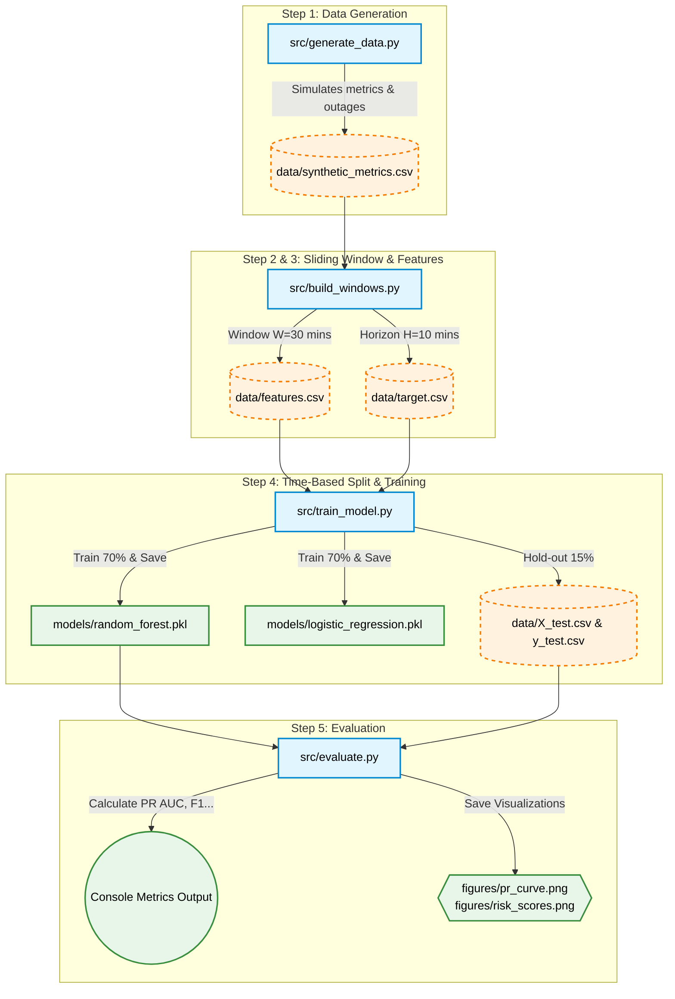

# Predictive Alerting for Cloud Metrics

## Overview
This project demonstrates a simplified predictive alerting pipeline for cloud monitoring metrics.  
The goal is to predict whether an incident will occur within the next **H** time steps based on the previous **W** time steps of system behavior.

The solution is implemented as a binary classification task on time-series data using a synthetic dataset that imitates cloud infrastructure monitoring.

---

## Project Goal
The objective of this project is to build a model that can provide an early warning about a possible incident before it happens.

At each time step, the model observes a recent history of monitoring metrics and predicts whether an incident will occur in the near future.

---

## Problem Formulation
This task is formulated as a **binary classification problem over time-series data**.

- **Input:** previous `W = 30` time steps
- **Prediction horizon:** next `H = 10` time steps
- **Output:**
  - `1` — an incident will occur within the next H steps
  - `0` — no incident will occur within the next H steps

One time step represents **1 minute**.

So, the model uses the previous **30 minutes** of monitoring data to predict whether an incident will happen during the next **10 minutes**.

---

## Dataset
This project uses a **synthetic time-series dataset** designed to imitate cloud monitoring behavior.

### Metrics
The dataset contains the following monitoring metrics:
- CPU usage
- Memory usage
- Request latency
- Error rate

### Dataset behavior
The generated time series includes:
- normal operating periods
- random noise
- gradual metric changes
- degradation patterns before incidents
- incident intervals
- recovery periods after incidents

### Why synthetic data
Synthetic data was selected because it allows full control over:
- incident generation
- data structure
- metric behavior
- labeling strategy

This makes the modeling pipeline easier to explain and reproduce.

---

## Incident Definition
An incident is defined as a period of service degradation reflected by abnormal behavior in one or more core metrics.

Examples of incident-related behavior include:
- CPU usage exceeding a critical threshold for several consecutive steps
- Error rate rising above a critical threshold
- Strong simultaneous increase in CPU usage, latency, and error rate

The incident labels are generated programmatically during dataset creation.

---

## Methodology

### 1. Data Generation
A synthetic cloud monitoring dataset is generated programmatically.

The dataset simulates:
- stable system behavior
- noisy fluctuations
- gradual degradation before failure
- incident periods
- recovery after incidents

### 2. Sliding Window Formulation
The task is transformed into a supervised learning problem using a sliding window.

For each valid time step:
- the input contains the previous `W = 30` observations
- the target indicates whether at least one incident occurs in the next `H = 10` steps

### 3. Feature Engineering
Instead of using raw windows directly, features are extracted from each window.

Possible features include:
- mean
- standard deviation
- minimum
- maximum
- last observed value
- trend / slope
- difference between first and last value

These features are computed for each metric.

### 4. Modeling
The project starts with simple and interpretable machine-learning baselines, such as:
- Logistic Regression
- Random Forest

Additional models may be tested later if needed.

### 5. Evaluation
The solution is evaluated using a **time-based split**:
- training set
- validation set
- test set

This avoids data leakage and preserves the temporal structure of the task.

The following metrics are used:
- Precision
- Recall
- F1-score
- ROC AUC
- PR AUC

Threshold selection is also analyzed to balance:
- false positives
- missed incidents
- alert fatigue

---



## Project Structure

```text
predictive-alerting-cloud-metrics/
├─ README.md
├─ requirements.txt
├─ data/
│  └─ synthetic_metrics.csv
├─ notebooks/
│  └─ solution.ipynb
├─ src/
│  ├─ generate_data.py
│  ├─ build_windows.py
│  ├─ train_model.py
│  └─ evaluate.py
└─ figures/
   ├─ metrics_incidents.png
   ├─ pr_curve.png
   └─ risk_scores.png


   
