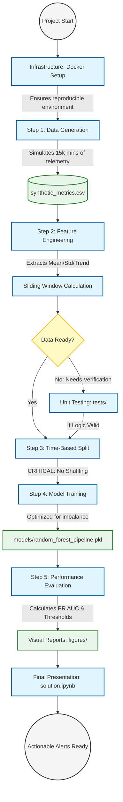

# Predictive Alerting for Cloud Metrics

A professional Machine Learning pipeline designed to predict infrastructure incidents before they occur. This project demonstrates end-to-end engineering: from synthetic data generation to automated model evaluation, unit testing, and containerization.

---

## 🚀 Problem Formulation
This task is formulated as a **binary classification problem over time-series data**:

* **Goal:** Predict whether an incident will occur within the next **H** steps based on the previous **W** steps of system behavior.
* **Input (Features):** Previous `W = 30` time steps (look-back window).
* **Prediction Horizon (Target):** Next `H = 10` time steps.
* **Output:**
  * `1` — an incident **will occur** within the next H steps.
  * `0` — no incident will occur.
* **Time Scale:** One time step represents **1 minute**.

---

## 🛠 Project Structure
```text
predictive-alerting-cloud-metrics/
├─ src/                        # Core Python modules with Type Hinting
│  ├─ generate_data.py         # Synthetic telemetry generation
│  ├─ build_windows.py         # Feature engineering (sliding windows)
│  ├─ train_model.py           # Model training (Time-based split)
│  └─ evaluate.py              # Performance metrics & plotting
├─ notebooks/                  # Interactive analysis
│  └─ solution.ipynb           # Final project walkthrough & visualizations
├─ tests/                      # Quality Assurance
│  └─ test_logic.py            # Unit tests for feature extraction logic
├─ data/                       # Raw and processed datasets (CSV)
├─ models/                     # Serialized model pipelines (.pkl)
├─ figures/                    # PR Curves and Risk Timeline artifacts
├─ DESIGN_DOC.MD               # Detailed architecture & design decisions
├─ Dockerfile                  # Container definition for reproducibility
├─ docker-compose.yml          # Multi-container orchestration
├─ requirements.txt            # Project dependencies
└─ README.md                   # Project overview and quick start
```


---

## 🚀 Quick Start (Docker)
The easiest way to run the entire pipeline (data generation -> feature engineering -> training -> evaluation) is using Docker Compose:

```bash
docker-compose up --build
```

---

## 🏗 Architecture Flow
This diagram illustrates the high-level workflow and technical branching logic.



---

## 🔬 The Microscopic View
Detailed module interaction and data transformation pipeline.

```mermaid
flowchart TD
    %% Colors
    classDef docker fill:#fce4ec,stroke:#d81b60,stroke-width:2px;
    classDef script fill:#e1f5fe,stroke:#0288d1,stroke-width:2px;
    classDef data fill:#fff3e0,stroke:#f57c00,stroke-width:2px,stroke-dasharray: 5 5;
    classDef model fill:#e8f5e9,stroke:#388e3c,stroke-width:2px;
    classDef test fill:#fffde7,stroke:#fbc02d,stroke-width:2px;

    subgraph Container_Layer
        D1[Dockerfile]:::docker -->|Builds env| Img(Python 3.9 Image):::docker
        D2[docker-compose.yml]:::docker -->|Mounts volumes| Img
    end

    subgraph Data_Science_Layer
        S1[generate_data.py]:::script -->
